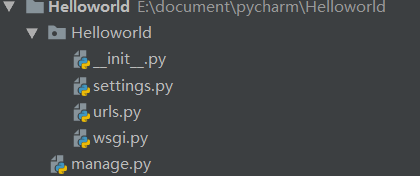

## Django系统
- 环境
  - python 3.7
  - django 2.2.2

## 环境搭建
- anaconda + pychram
- anaconda使用
  - conda list:显示当前环境安装的包
  - conda env list:显示安装的虚拟环境列表
  - conda create -n env_name python=3.6
  - 激活conda的虚拟环境
    - (Linux)source activate env_name
    - (win)activate env_name
  - pip install django==版本号
  
 ## 后台需要的流程

 ## 第一个Django项目
 - django-admin startproject 项目名：创建项目
 

 
 

 
- HelloWorld: 项目的容器，一般控制个整个项目，不负责具体的业务实现,具体的业务流程由后面的APP实现。
- manage.py: 一个实用的命令行工具，可让你以各种方式与该 Django 项目进行交互。
- HelloWorld/__init__.py: 一个空文件，告诉 Python 该目录是一个 Python 包。
- HelloWorld/settings.py: 该 Django 项目的设置/配置。
- HelloWorld/urls.py: 该 Django 项目的 URL 声明; 一份由 Django 驱动的网站"目录"。
- HelloWorld/wsgi.py: 一个 WSGI 兼容的 Web 服务器的入口，以便运行你的项目。
- python manage.py runserver:启动Django

## 创建APP
- cd 项目文件夹
- python manage.py startapp app名：创建实现具体业务的APP名

## 路由系统-urls
- 分析请求，然后找到具体的业务（APP）去处理
- django的信息控制中枢
- 在接受URL请求的匹配上使用RE

